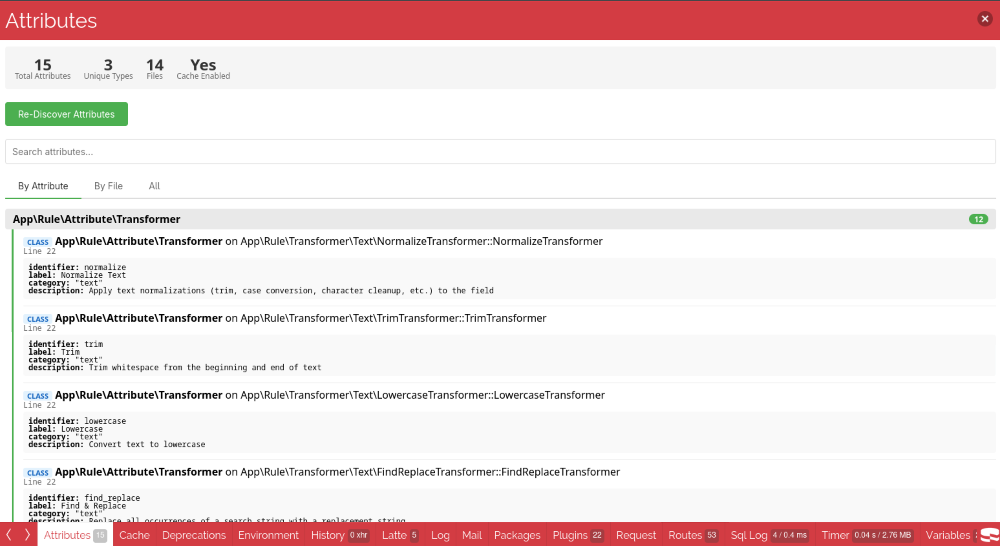

[](https://github.com/josbeir/cakephp-attribute-registry)
[](https://github.com/josbeir/cakephp-attribute-registry/actions)
[](https://codecov.io/github/josbeir/cakephp-attribute-registry)
[](https://opensource.org/licenses/MIT)
[](https://www.php.net/releases/8.2/en.php)
[](https://cakephp.org/)
[](https://packagist.org/packages/josbeir/cakephp-attribute-registry)

# CakePHP Attribute Registry Plugin

A powerful CakePHP plugin for discovering, caching, and querying PHP 8 attributes across your application and plugins.

## Table of Contents

- [Overview](#overview)
- [Requirements](#requirements)
- [Installation](#installation)
- [Configuration](#configuration)
    - [Configuration Options](#configuration-options)
    - [Disabling Cache](#disabling-cache)
    - [Smart Cache Validation](#smart-cache-validation)
    - [Cache Configuration](#cache-configuration)
    - [Attribute Argument Requirements](#attribute-argument-requirements)
- [Usage](#usage)
    - [Accessing the AttributeRegistry](#accessing-the-attributeregistry)
        - [Option 1: Singleton](#option-1-singleton)
        - [Option 2: Dependency Injection](#option-2-dependency-injection)
    - [Discovery Methods](#discovery-methods)
        - [Discover All Attributes](#discover-all-attributes)
        - [Fluent Filtering with AttributeCollection](#fluent-filtering-with-attributecollection)
        - [Find by Attribute Name](#find-by-attribute-name)
        - [Find by Class Name](#find-by-class-name)
        - [Find by Target Type](#find-by-target-type)
        - [Cache Management](#cache-management)
    - [Working with AttributeInfo](#working-with-attributeinfo)
    - [Example: Building a Route Registry](#example-building-a-route-registry)
- [Console Commands](#console-commands)
    - [Discover Attributes](#discover-attributes)
    - [List Attributes](#list-attributes)
    - [Inspect Attributes](#inspect-attributes)
- [DebugKit Panel](#debugkit-panel)
- [Testing](#testing)
- [Contributing](#contributing)
- [License](#license)
- [Credits](#credits)

## Overview

The CakePHP Attribute Registry Plugin provides a centralized system for discovering and managing PHP 8 attributes throughout your CakePHP application. It scans your codebase for attributes on classes, methods, properties, parameters, and constants, then caches the results for fast retrieval.

**Key Features:**

- 🔍 **Automatic Discovery** - Scans PHP files for attributes using configurable glob patterns
- 💾 **Built-in Caching** - Caches discovered attributes
- 🔎 **Flexible Querying** - Find attributes by name, class, or target type
- 🔌 **Plugin Support** - Automatically scans all loaded CakePHP plugins
- 🖥️ **CLI Tools** - Console commands for discovery, listing, and inspection
- 🏗️ **Service-Oriented** - Clean architecture with dependency injection via CakePHP's container
- 🐛 **DebugKit Panel** - Visual panel for browsing discovered attributes during development

**Supported Attribute Targets:**

| PHP Target | Constant | Supported | Example |
|------------|----------|:---------:|---------|
| Class | `Attribute::TARGET_CLASS` | ✅ | `#[Route] class MyController` |
| Method | `Attribute::TARGET_METHOD` | ✅ | `#[Get] public function index()` |
| Property | `Attribute::TARGET_PROPERTY` | ✅ | `#[Column] public int $id` |
| Parameter | `Attribute::TARGET_PARAMETER` | ✅ | `function show(#[FromPath] int $id)` |
| Class Constant | `Attribute::TARGET_CLASS_CONSTANT` | ✅ | `#[Deprecated] const STATUS = 1` |
| Function | `Attribute::TARGET_FUNCTION` | ❌ | Standalone functions not supported |

> [!NOTE]
> Standalone functions (`TARGET_FUNCTION`) are not supported because the plugin uses class-based reflection. In typical CakePHP applications, attributes are primarily used on classes and their members.

## Requirements

- PHP 8.2 or higher
- CakePHP 5.2 or higher

## Installation

Install the plugin using Composer:

```bash
composer require josbeir/cakephp-attribute-registry
```

Load the plugin in your `src/Application.php`:

```bash
bin/cake plugin load AttributeRegistry
```

## Configuration

The plugin works out of the box with sensible defaults.

### Configuration Options

```php
// config/app_attribute_registry.php
return [
    'AttributeRegistry' => [
        'cache' => [
            // Enable/disable caching (default: true)
            // When disabled, attributes are re-discovered on every request
            'enabled' => true,
            // Cache directory (defaults to CACHE . 'attribute_registry' . DS)
            'path' => CACHE . 'attribute_registry' . DS,
            // Validate file hashes on cache retrieval (default: false)
            // When enabled, cached entries are validated against file content changes
            // Useful in development to auto-rebuild cache when files change
            // Example: Configure::read('debug') enables validation only in debug mode
            'validateFiles' => false,
        ],
        'scanner' => [
            // Glob patterns for files to scan (relative to base paths)
            'paths' => [
                'src/**/*.php',
            ],
            // Glob patterns for paths to exclude
            'exclude_paths' => [
                'vendor/**',
                'tmp/**',
                'logs/**',
                'tests/**',
                'webroot/**',
            ],
            // Attribute classes to exclude from discovery
            'exclude_attributes' => [
                'Override',           // Exact FQCN match
                'App\\Internal\\*',   // Namespace wildcard
            ],
        ],
    ],
];
```

### Disabling Cache

You can disable caching for development purposes by setting `cache.enabled` to `false`:

```php
'AttributeRegistry' => [
    'cache' => [
        'enabled' => false,
    ],
],
```

> [!WARNING]
> Disabling cache will cause attributes to be re-discovered on every request, which may impact performance. Only use this for development.

### Smart Cache Validation

Instead of disabling the cache entirely, you can enable **file hash validation** to automatically invalidate stale cache entries when files change:

```php
use Cake\Core\Configure;

'AttributeRegistry' => [
    'cache' => [
        'enabled' => true,
        // Auto-enable validation in debug mode
        'validateFiles' => Configure::read('debug', false),
    ],
],
```

When `validateFiles` is enabled:
- ✅ **Cache remains active** - Fast performance
- ✅ **Auto-detects changes** - Validates file content hashes (xxh3) on cache load
- ✅ **Granular invalidation** - Only rebuilds when cached files are modified

> [!IMPORTANT]
> **Limitation:** This only validates **existing cached entries**. When you add **new attributes** to your codebase, you still need to manually refresh the cache:
> ```bash
> bin/cake attribute discover
> # or in code:
> $registry->clearCache();
> ```

> [!TIP]
> This is the recommended approach for development - you get cache performance benefits and automatic detection of changes to existing attributes, while only needing manual cache clearing when adding new ones.

### Cache Configuration

The plugin uses **compiled cache files** for zero-cost attribute caching. Discovered attributes are stored as pre-compiled PHP files with direct object instantiation, leveraging OPcache for maximum performance.

**Cache Location**: By default, cache files are stored in `tmp/cache/attribute_registry/`. You can customize this path:

```php
'AttributeRegistry' => [
    'cache' => [
        'path' => CACHE . 'attributes' . DS, // Custom cache directory
    ],
],
```

**How it Works**:
1. During discovery, attributes are scanned and serialized into executable PHP files
2. The compiled files contain direct `AttributeInfo` object instantiation code
3. OPcache automatically optimizes these files for near-zero overhead on subsequent loads

**Performance**: Compiled cache eliminates deserialization overhead entirely - loading cached attributes is as fast as requiring a PHP file with predefined objects.

**Automatic Cache Clearing**: When you run `bin/cake cache clear_all`, the AttributeRegistry cache is automatically refreshed via the attribute discovery process. Disable this behavior if needed:

```php
'AttributeRegistry' => [
    'disableCacheClearListener' => true,
],
```

### Attribute Argument Requirements

The compiled cache uses `var_export()` to serialize attribute arguments. Most PHP types work seamlessly:

**Supported Types** (no special handling needed):
- Scalars: `string`, `int`, `float`, `bool`, `null`
- Arrays of supported types
- Enums (PHP 8.1+, natively supported)

**Object Arguments** require `__set_state()` implementation:

```php
class MyArgument
{
    public function __construct(
        public string $value,
    ) {}

    // Required for cache serialization
    public static function __set_state(array $data): self
    {
        return new self(
            value: $data['value'],
        );
    }
}

#[Attribute]
class MyAttribute
{
    public function __construct(
        public MyArgument $arg, // Object argument - needs __set_state()
    ) {}
}
```

> [!TIP]
> If caching fails because an object lacks `__set_state()`, an error will be logged at `logs/error.log` and the attribute will be skipped from the cache.

## Usage

### Accessing the AttributeRegistry

The `AttributeRegistry` can be accessed in two ways:

#### Option 1: Singleton

Use `getInstance()` anywhere in your application without requiring dependency injection:

```php
use AttributeRegistry\AttributeRegistry;

// Anywhere in your code
$registry = AttributeRegistry::getInstance();
$routes = $registry->findByAttribute('Route');
```

#### Option 2: Dependency Injection

The registry is also available via CakePHP's dependency injection container:

```php
use AttributeRegistry\AttributeRegistry;

// In a Controller
class MyController extends AppController
{
    public function index(AttributeRegistry $registry): Response
    {
        $routes = $registry->findByAttribute('Route');
        // ...
    }
}

// In a Command
class MyCommand extends Command
{
    public function __construct(
        private readonly AttributeRegistry $registry,
    ) {
        parent::__construct();
    }
}
```

Both approaches return the same singleton instance, ensuring consistent caching behavior.

### Discovery Methods

The `AttributeRegistry` service provides several methods for finding attributes:

> [!NOTE]
> All query methods (`findByAttribute`, `findByClass`, `findByTargetType`) internally call `discover()`. The discovery result is cached after the first call, so subsequent queries within the same request are fast. When adding new attributes to your codebase, clear the cache using `$registry->clearCache()` or run `bin/cake attribute discover` to refresh the registry.

#### Discover All Attributes

The `discover()` method returns an `AttributeCollection` - a powerful extension of CakePHP's Collection with domain-specific filter methods:

```php
// Get all discovered attributes as a collection
$attributes = $registry->discover();

// Convert to array when needed
$array = $attributes->toList();
```

#### Fluent Filtering with AttributeCollection

The `AttributeCollection` provides chainable filter methods for building complex queries. All filter methods accept multiple arguments with **OR logic** (matches any):

```php
use AttributeRegistry\Enum\AttributeTargetType;

// Filter by exact attribute class (single or multiple)
$routes = $registry->discover()
    ->attribute(Route::class)
    ->toList();

// Multiple attributes - matches Route OR Get OR Post
$httpAttributes = $registry->discover()
    ->attribute(Route::class, Get::class, Post::class)
    ->toList();

// Filter by namespace pattern (supports wildcards)
$appAttributes = $registry->discover()
    ->namespace('App\\Controller\\*')
    ->toList();

// Multiple namespaces
$attributes = $registry->discover()
    ->namespace('App\\Controller\\*', 'App\\Model\\*')
    ->toList();

// Filter by target type (single or multiple)
$methodAttributes = $registry->discover()
    ->targetType(AttributeTargetType::METHOD)
    ->toList();

// Methods OR properties
$memberAttributes = $registry->discover()
    ->targetType(AttributeTargetType::METHOD, AttributeTargetType::PROPERTY)
    ->toList();

// Filter by exact class name (single or multiple)
$controllerAttributes = $registry->discover()
    ->className(UsersController::class, PostsController::class)
    ->toList();

// Partial matching with contains methods
$routeAttributes = $registry->discover()
    ->attributeContains('Route')
    ->toList();

$controllerAttributes = $registry->discover()
    ->classNameContains('Controller')
    ->toList();
```

**Combining Filters**

Chain multiple filters to narrow down results (uses AND logic between different filter types):

```php
// Find all Route attributes on methods in the App\Controller namespace
$routes = $registry->discover()
    ->attribute(Route::class)
    ->namespace('App\\Controller\\*')
    ->targetType(AttributeTargetType::METHOD)
    ->toList();
```

**Using Standard Collection Methods**

Since `AttributeCollection` extends CakePHP's Collection, all standard methods are available:

```php
// Group attributes by class
$grouped = $registry->discover()
    ->attribute(Route::class)
    ->groupBy(fn($attr) => $attr->className)
    ->toArray();

// Filter with custom logic
$postRoutes = $registry->discover()
    ->attribute(Route::class)
    ->filter(fn($attr) => ($attr->arguments['method'] ?? 'GET') === 'POST')
    ->toList();

// Map to extract specific data
$paths = $registry->discover()
    ->attribute(Route::class)
    ->map(fn($attr) => $attr->arguments['path'] ?? '/')
    ->toList();

// Count results
$count = $registry->discover()
    ->attribute(Route::class)
    ->count();

// Check if any exist
$hasRoutes = $registry->discover()
    ->attribute(Route::class)
    ->isEmpty() === false;
```

#### Find by Attribute Name

```php
// Find all usages of a specific attribute
$routes = $registry->findByAttribute(Route::class);
$columns = $registry->findByAttribute(Column::class);

// Partial matching is also supported
$routes = $registry->findByAttribute('Route');
```

#### Find by Class Name

```php
// Find attributes on a specific class
$attributes = $registry->findByClass(UserController::class);

// Partial matching is also supported
$attributes = $registry->findByClass('Controller');
```

#### Find by Target Type

```php
use AttributeRegistry\Enum\AttributeTargetType;

// Find all class-level attributes
$classAttributes = $registry->findByTargetType(AttributeTargetType::CLASS_TYPE);

// Find all method-level attributes
$methodAttributes = $registry->findByTargetType(AttributeTargetType::METHOD);

// Find all property-level attributes
$propertyAttributes = $registry->findByTargetType(AttributeTargetType::PROPERTY);
```

#### Cache Management

```php
// Clear all cached attribute data (removes compiled cache files)
$registry->clearCache();

// Warm the cache (clear and rediscover - regenerates compiled files)
$registry->warmCache();

// Check if cache is enabled
if ($registry->isCacheEnabled()) {
    // Cache is active
}
```

The cache records file modification timestamps (`filemtime`) for discovered attributes, which you can use to detect when source files have changed and decide when to rebuild or clear the cache.

### Working with AttributeInfo

Each discovered attribute is returned as an `AttributeInfo` value object:

```php
use AttributeRegistry\ValueObject\AttributeInfo;

foreach ($registry->discover() as $attr) {
    // Basic information
    echo $attr->attributeName;  // Full attribute class name
    echo $attr->className;      // Class containing the attribute
    echo $attr->filePath;       // File where attribute was found
    echo $attr->lineNumber;     // Line number in file

    // Attribute arguments
    print_r($attr->arguments);  // Array of constructor arguments

    // Target information
    echo $attr->target->type->value;    // 'class', 'method', 'property', etc.
    echo $attr->target->targetName;     // Name of the target element
    echo $attr->target->parentClass;    // Parent class (for methods/properties)

    // Instantiate the actual attribute
    $instance = $attr->getInstance();

    // With type safety
    $route = $attr->getInstance(MyRoute::class);
}
```

### Example: Building a Route Registry

```php
use Attribute;

#[Attribute(Attribute::TARGET_CLASS)]
class Route
{
    public function __construct(
        public string $path,
        public string $method = 'GET',
    ) {}
}

#[Attribute(Attribute::TARGET_METHOD)]
class Get
{
    public function __construct(
        public ?string $path = null,
    ) {}
}

// Controller
#[Route('/users')]
class UsersController
{
    #[Get('/')]
    public function index(): void {}

    #[Get('/{id}')]
    public function view(int $id): void {}
}

// In your application
$routes = $registry->findByAttribute(Route::class);
foreach ($routes as $routeInfo) {
    $route = $routeInfo->getInstance(Route::class);
    echo "Route: {$route->path} ({$route->method})";
}
```

## Console Commands

The plugin provides three console commands for managing attributes:

### Discover Attributes

Scan and cache all attributes:

```bash
bin/cake attribute discover
```

Output:
```
Clearing attribute cache...
Discovering attributes...
Discovered 42 attributes in 0.234s
```

### List Attributes

List discovered attributes with optional filtering:

```bash
# List all attributes
bin/cake attribute list

# Filter by attribute name
bin/cake attribute list --attribute Route

# Filter by class name
bin/cake attribute list --class UserController

# Filter by target type
bin/cake attribute list --type method
```

Output:
```
Found 5 attributes:

+---------------------------+----------------------------------+--------+-----------------+
| Attribute                 | Class                            | Type   | Target          |
+---------------------------+----------------------------------+--------+-----------------+
| App\Attribute\Route       | App\Controller\UsersController   | class  | UsersController |
| App\Attribute\Get         | App\Controller\UsersController   | method | index           |
| App\Attribute\Get         | App\Controller\UsersController   | method | view            |
| MyPlugin\Attribute\Cache  | MyPlugin\Model\Table\PostsTable  | method | findPublished   |
| MyPlugin\Attribute\Queue  | MyPlugin\Service\EmailService    | method | sendWelcome     |
+---------------------------+----------------------------------+--------+-----------------+
```

### Inspect Attributes

View detailed information about specific attributes:

```bash
# Inspect by attribute name
bin/cake attribute inspect Route

# Inspect attributes on a specific class
bin/cake attribute inspect --class UserController
bin/cake attribute inspect -c UserController
```

Output:
```
Found 2 attributes for attribute "Route":

1. App\Attribute\Route
   Class: App\Controller\UsersController
   Target: UsersController (class)
   File: /path/to/src/Controller/UsersController.php:12
   Arguments:
     - path: /users
     - method: GET
```

## DebugKit Panel

When [DebugKit](https://github.com/cakephp/debug_kit) is installed, the plugin automatically registers a panel for browsing discovered attributes.



The panel provides:
- Overview of all discovered attributes grouped by type or file
- Search functionality to filter attributes
- Re-discover button to refresh the attribute cache

## Testing

Run the test suite:

```bash
# Run all tests
composer test

# Run with coverage
composer test-coverage

# Run PHPStan analysis
composer phpstan

# Check code style
composer cs-check

# Fix code style
composer cs-fix

# Run Rector checks
composer rector-check
```

## Contributing

Contributions are welcome! Please follow these guidelines:

1. **Code Standards**: Follow CakePHP coding standards
2. **Tests**: Add tests for new features
3. **PHPStan**: Ensure level 8 compliance
4. **Documentation**: Update README for new features

### Development Setup

```bash
# Clone the repository
git clone git@github.com:josbeir/cakephp-attribute-registry.git
cd cakephp-attribute-registry

# Install dependencies
composer install

# Run tests
composer test

# Run static analysis
composer phpstan
```

## License

This plugin is open-sourced software licensed under the [MIT license](LICENSE.md).

## Credits

- Built with [CakePHP](https://cakephp.org/)
